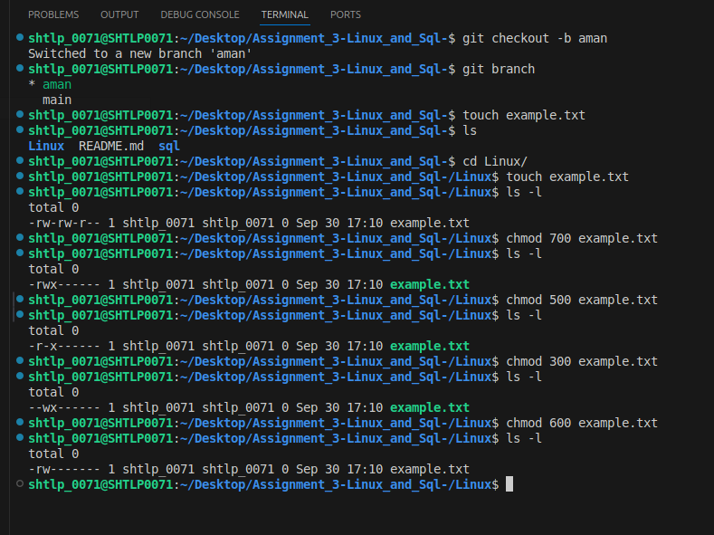
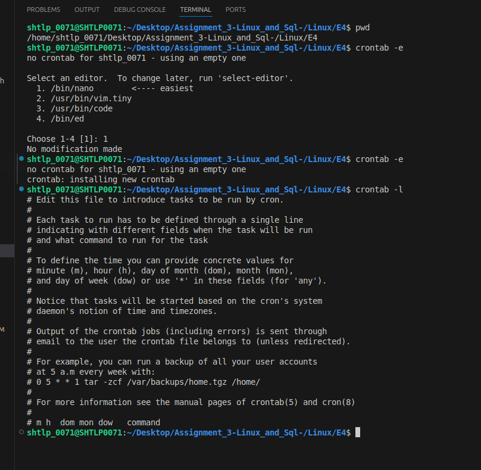

# Assignment_3-Linux_and_Sql-

## Linux
There are 4 assignment in this section
- ### Assignment 1 - File Permissions:
    - Create the `example.txt` file using below command.
    - Commands used - `touch`, `chmod`, `ls -l` - to create the file, change the file permissions to executable and list all the file permissions respectively.
    

- ### Assignment 2 - Process Management
    - Use `top` to list all the running processes, 
    
    - Get the pid of a running process using `pidof` command,
    
    - kill the process using `kill <pid of process>` command.

- ### Assignment 3 - Shell script that continuously monitors the system for new processes.
    - Create the process by running the script, `create_dummy_processes.sh`. It will give us the processes with 'Kill_Me' names in it.
    - Create the scirpt `monitor_kill_processes.sh` which will kill the processes with 'Kill_Me' name init.
    - A log file `killed_processes.log` will get created, which will show us the killed processes details.

- ### Assignment 4 - Shell script that monitor for new files, do file size comparison, log the details.
    - Run the shell script `script.sh` that will monitor the directory `sample_files` and log the details in `file_monitor.log`.
    - Largest file size will be scaned and shown in the output in the log file `file_monitor.log`.
    - Set up a cron job to run the script every 10 minutes
    

---
--- 

## SQL
- ### Assignment 1 - Filtering and Sorting
    - Create `Order` table with the data set given in Assignment 1 sheet.
    - Perform the queries given in the assignment.

- ### Assignment 2 - Join multiple tables
    - Create `Customer` and `Product` table with the dataset given in assignment 2 sheet.
    - Perform the queries given in the assignment.

- ### Assignment 3 - Set Operations
    - Create two tables `employee-2023` and `employee-2024` and insert the data given in the assignment 3 sheet.
    - Perform the UNION, INTERSECTION set operation queries given.

- ### Assignment 4 - Combining the Linux and SQL
    - Create a script `Exercise4.sh` to create a database `company_db`.
    - Provide the credentials of MySQL databases and see your created db.
    - Enter in your mysql server using `mysql -u root -p`, this command.
    - Create tables `employees` and `departments` using the script.
    - Insert the data in the tables using script.
    - Execute the script.

[Dataset Link](https://shorthillstech-my.sharepoint.com/:x:/p/manpreet/EWElb3AclXNFuARUzVEpMvcBiXn0nDmUDfx4O4yfxG2o_A?e=yIHvWF&wdOrigin=LOOP-WEB.PREVIEW.NT&wduihid=240f833a-161d-4c0b-a2c4-3672cd4a3f8e&web=1&ct=1727694117281)