# Assignment_3-Linux_and_Sql-
## Linux 
### Task - 1(File Permissions)
![!\[alt text\]](Linux/screenshots/Task-1.png)

- `touch command` to create the example.txt file 
- `chmod 600 example.txt` modified its permissions so that only I, as the owner, can read and write to it, while the group and others have no access. Verified the permission changes by listing the file details using the `ls -l command`

## Task - 2(Process Management)
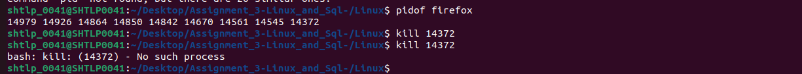
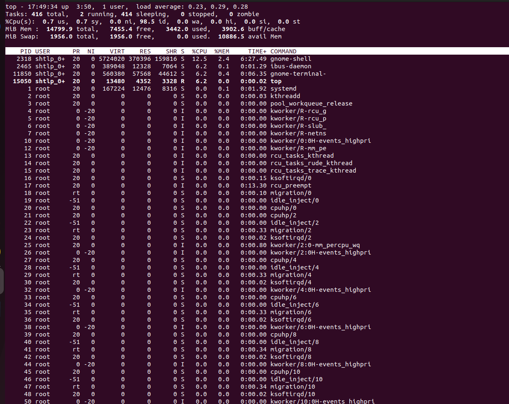

- Used the `top command` to view all running processes and identified the process ID (PID) of an active process (such as my terminal) using the `pidof(processname)`. 
- Terminated the process using its PID (`kill pid command`) and confirmed it was successfully stopped by giving the `kill command` again and the output being process doesn't exist.

## Task - 3(Monitor and Kill Processes)

- Shell script that continuously monitors the system for new processes.
    - First create the process by running the script, `create_dummy_processes.sh`. It will give us the processes with 'Kill_Me' names in it.
    - Create the scirpt `monitor_kill_processes.sh` which will kill the processes with 'Kill_Me' name init.
    - A log file `killed_processes.log` will get created, which will show us the killed processes details.
- `touch create_dummy_processes.sh` to create the file.
- `Nano create_dummy_processes.sh` to change the contents of the file using nano editor.
- `cat create_dummy_processes.sh` to see the contents of the file.
- `chmod +x create_dummy_processes.sh` to change the file permissions to execute 
- `./create_dummy_processes.sh` to see the killed processes

## Task - 4(shell script)
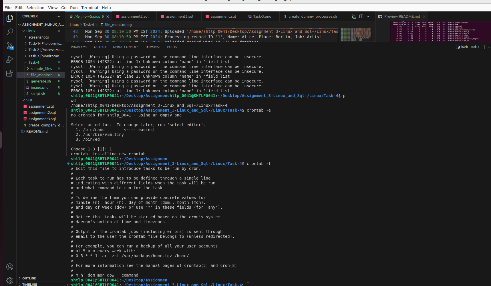
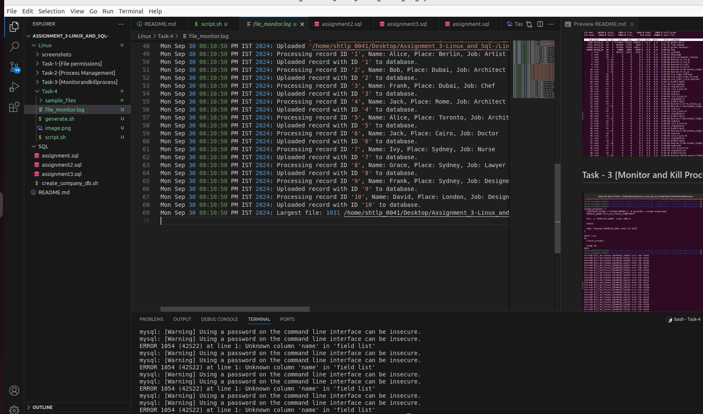

- The Linux-Task-4-generate.sh script generates random data and outputs it in a file and stores the same data in Mysql table.
- The Linux-Task-4-script.sh file then monitors the directory for new created or modified files and recursively scans all directories for the largest file.
- This data about the files(name, size, and timestamp of processed files, and whether duplicates were detected) is then logged into Linux-Task-4-file_monitor.log file.

## SQL 
### Task - 1(filtering and sorting)
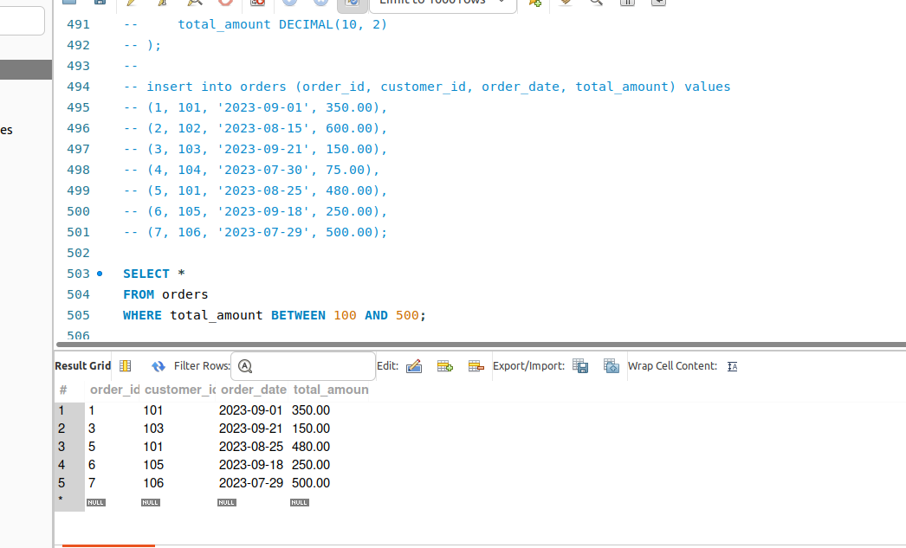
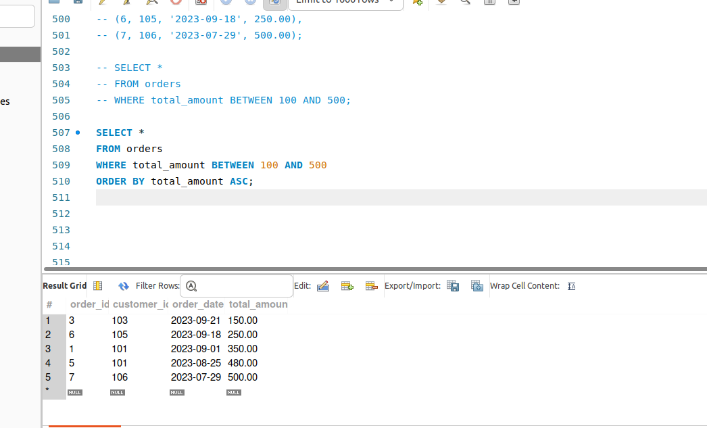
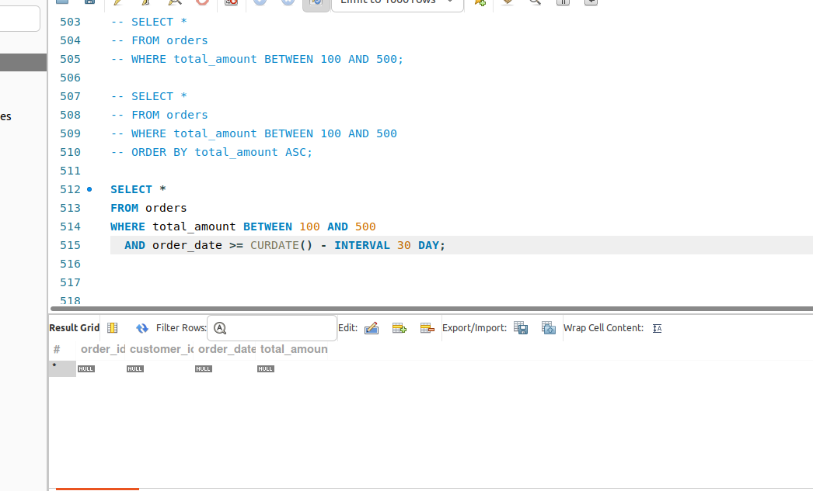

- This project involves creating a database table called orders, inserting sample data into it, and running SQL queries to filter and sort the data.
- The orders table stores details about customer orders, including order ID, customer ID, order date, and the total amount. Sample data is added for various customers and orders.
- Wrote three queries to get-
1. Filter orders where the total amount is between 100 and 500 using the `BETWEEN CLAUSE`.
2. Retrieve and sort orders by total amount in ascending order using `ORDER BY CLAUSE`.
3. Filter orders with a total amount between 100 and 500, placed within the last 30 days `Using curdate clause`.
- These examples showcase basic SQL operations like filtering, sorting, and working with date intervals.

### Task - 2(Join with Mulitple Tables)
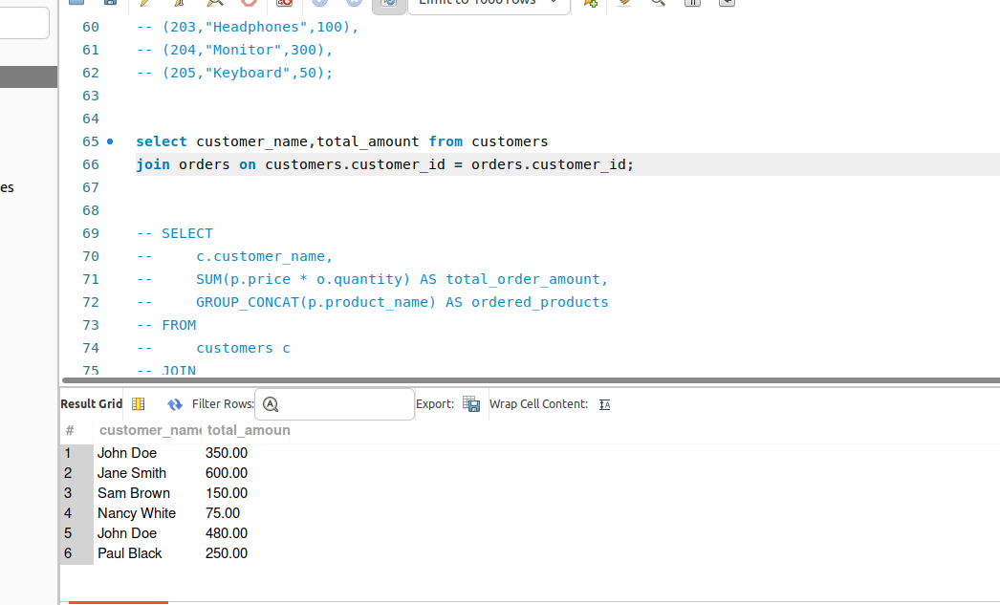

- This project involves creating two tables: customers and products, with details about customers and products, respectively. Sample data for customers (names and cities) and products (names and prices) are inserted into these tables.
- The SQL queries demonstrate joining the customers, orders, and products tables to perform:
- Wrote a query to join customers and orders using the customer_id, and display the customer_name and their corresponding total order amount.
- Extend the query by joining with the products table to show which products each customer has ordered.
- Note- This query will not work as the orders table does not have product_id column that is needed to join with the products table and show the product name for each customer.
  
### Task - 3(Set operations)
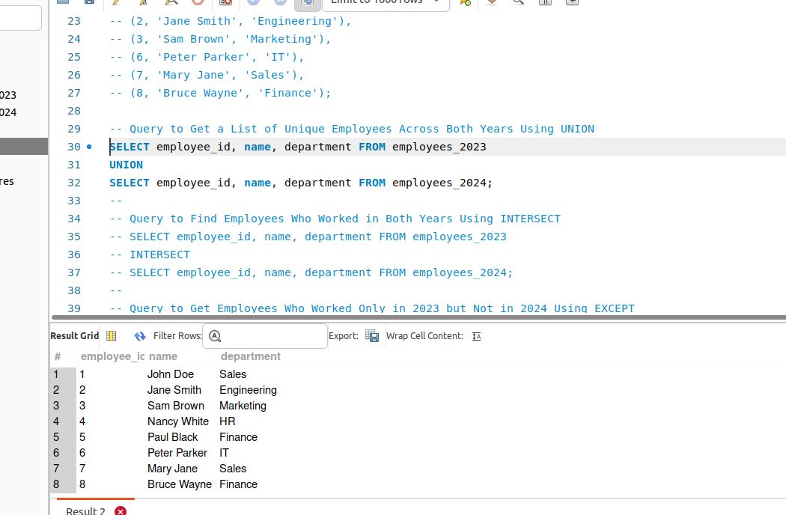
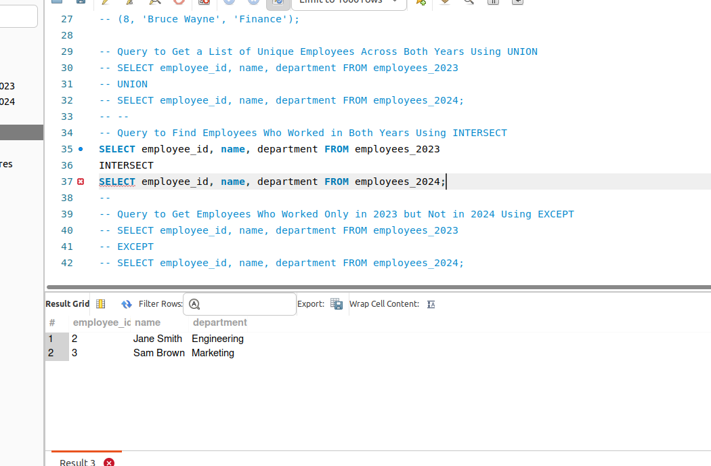
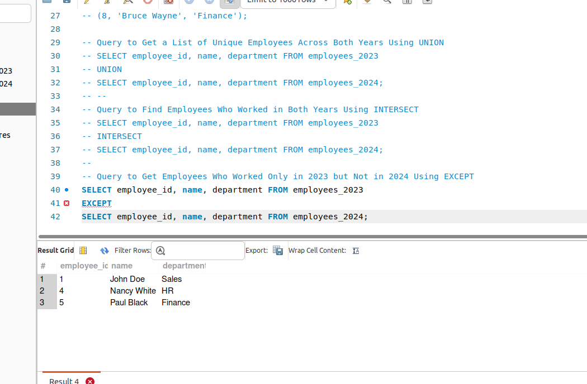

- This project involves two tables, employees_2023 and employees_2024, which contain employee records for each respective year. The data includes the employee's ID, name, and department. SQL queries are used to analyze the data across the two years, such as finding unique employees, employees common to both years, and those who only worked in 2023.

- Table Structure
    employees_2023
-       employee_id: Unique ID for each employee.
-       name: Employee's full name.
-       department: Department where the employee worked in 2023.
- employees_2024
-   employee_id: Unique ID for each employee.
-   name: Employee's full name.
-   department: Department where the employee worked in 2024.
- Data Insertion: Sample data is inserted into both employees_2023 and employees_2024, representing employees and their respective departments for each year.

Queries
1. Unique Employees Across Both Years:
This query retrieves a list of all unique employees who worked in either 2023 or 2024 using the `UNION operator`.

2. Employees Common to Both Years:
This query finds employees who worked in both 2023 and 2024 by using the `INTERSECT operator`.

3.Employees Who Worked Only in 2023.
This query retrieves the list of employees who worked in 2023 but not in 2024 using the `EXCEPT operator`.

### Task - 4(Combining Linux and SQL)
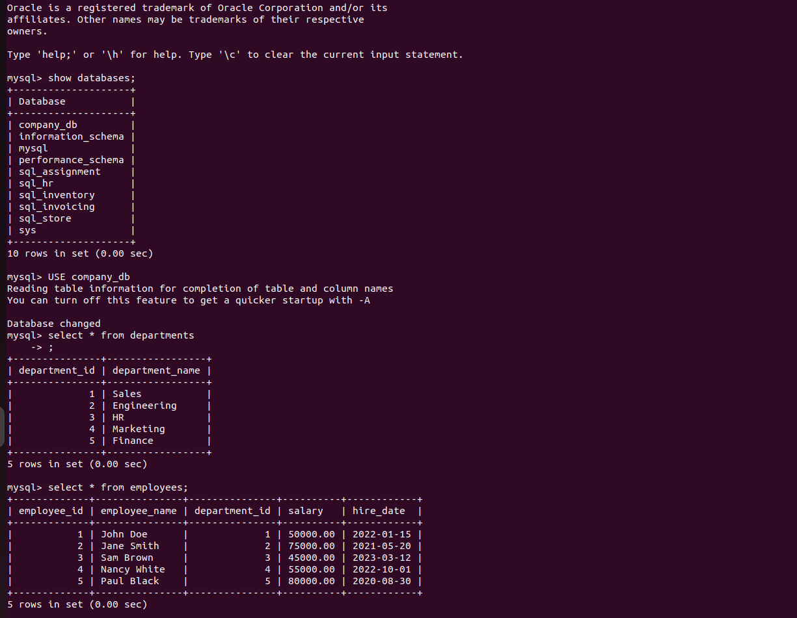
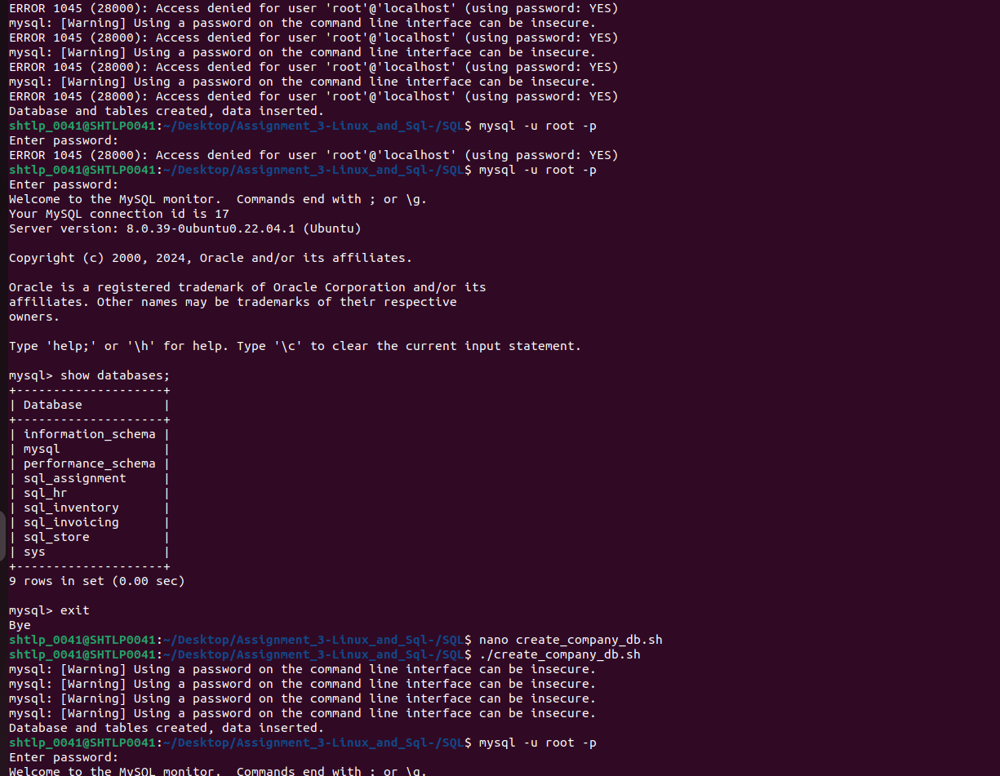
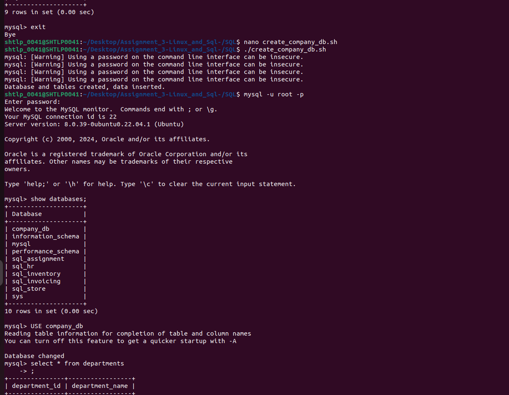

This project involves querying the company_db database to explore its structure and content. The following actions are performed:

1. Show All Tables: The `SHOW TABLES command` is used to list all the tables available in the company_db database.

2. Retrieve Data from the departments Table: A query is executed to select and display all records from the departments table, which contains information related to different departments within the company.

3. Retrieve Data from the employees Table: A query is run to select and display all records from the employees table, providing information about the employees, such as their IDs, names, and other relevant details.

- These queries allow for an exploration of contents of the departments and employees tables.

