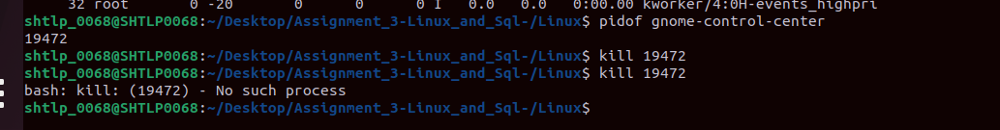
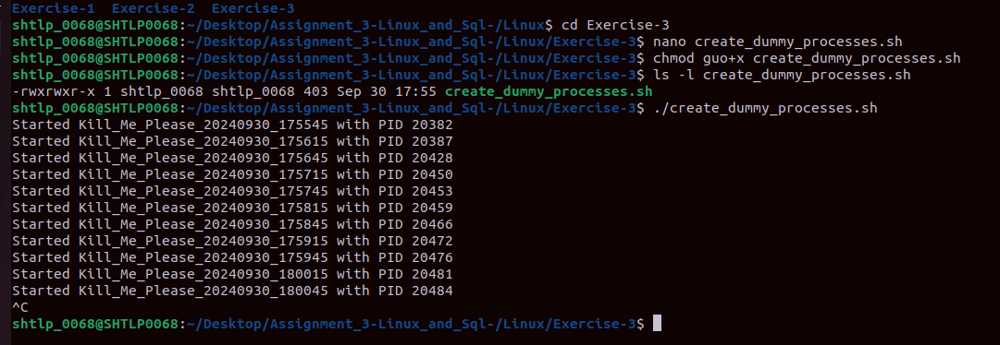

# Assignment_3-Linux_and_Sql-

## Linux

### Task - 1 (File Permission)

- Created an example.txt file using touch command and changed the file permission using chmod command

---

### Task - 2 (Process Management)

- Saw all the running processes through the top command 
- Found the pid of the gnome-control-center using "pidof" command
- Terminated that process using the kill command

---

### Task - 3 (Shell Script continuously monitors the system for new processes)

- Created a dummy processes using the script **create_dummy_processes** given to us. It contained processes which begin with "Kill_Me"
- Created a **monitor_kill_processes** which will kill the processes beginning with "Kill_Me"
- A log file is created with name **killed_processes.log**which stores the details of the killed processes.

### Task - 4

- Shell script that monitor for new files, do file size comparison, log the details.
- Run the shell script **script.sh** that will monitor the directory **sample_files** and log the details in **file_monitor.log**.
- Largest file size will be scaned and shown in the output in the log file **file_monitor.log**.
- Set up a cron job to run the script every 10 minutes

---

## SQL

### Task 1

- Created the **Orders** Table and performed the queries given to us in task-1

---

### Task 2

- Created **Customer** and **Orders** table with the data given to us and performed the queries of the questions given to us
- Implemented **join** in the queries
- The last query couldn't be performed because there was no common column between products and customers table

### Task 3
- Created table **Employees 2023** and **Employees 2024** in the database with the data given and performed the queries
- Implemented **union, intersect, except** in the queries

### Task 4

- Create a script **Exercise4.sh** to create a database "company_db".
- Provide the credentials of MySQL databases and see your created db.
- Enter in your mysql server using **mysql -u root -p**, this command.
- Create tables **employees** and **departments** using the script.
- Insert the data in the tables using script.
- Execute the script.

[DATASET LINK](https://shorthillstech-my.sharepoint.com/:x:/p/manpreet/EWElb3AclXNFuARUzVEpMvcBiXn0nDmUDfx4O4yfxG2o_A?e=yIHvWF&wdOrigin=LOOP-WEB.PREVIEW.NT&wduihid=bb4e3a6d-1273-4651-88e5-c915ac010ee6&web=1&ct=1727765237864)