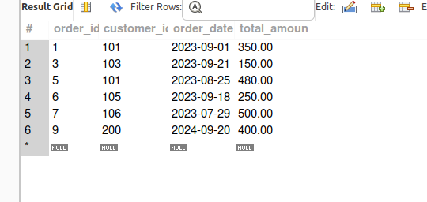

# Assignment_3-Linux_and_Sql-

Linux Exercise:

 ## Task 1: File Creation and Permission Modification
- Created a file named example.txt:
- Command used: touch example.txt

- Changed the permissions of example.txt so that only the owner has r -  read and write permissions:

 - Command used : chmod 600 example.txt

 - attached the sceenshot named example.txt.png

 
# task 2  
     
     
- Checked the running processes on the system using the process status ps -ux

- Killed a specific process by using the kill command.

- Verified if the process was successfully terminated by checking its process ID    ps -p   pid

- Attached a screenshot named killed_processes.png showing the terminated processes.

# task 3

- created a bash script in file named   create_dummy_process.sh that will create new dummy processes in every 30 seconds and 
  given the exutable permition using chmod 
- created another bash script in the file monitor_kill_process.sh that will will search the processes with name starting with Kill 
  and given the exutable permition for that
- and also it will generate log file named "kill_processes.log"  that will store all the log history of this processes

- dummy process created 

- log file storing loghistory 

- ## Task 4  
   - Shell script that monitor for new files, do file size comparison, log the details.

    - Run the shell script `script.sh` that will monitor the directory `sample_files` and log the details in `file_monitor.log`.

    - Largest file size will be scaned and shown in the output in the log file `file_monitor.log`.

    - Set up a cron job to run the script every 10 minutes

        

- cheak for the codes and files structure in Task-4 folder inside the directory Linux

#   SQL Exercise :

## task 1   Filtering and Sorting

- created the a database named sql_assignment  using the command  create database sql_assignment

     

- Created a table called orders with the following columns: order_id, customer_id, order_date, total_amount.
- inserted the data into tables 
- Written  a query to select orders where the total_amount is between $100 and $500

    
      
-  Sort the results by total_amount in ascending order.
 

 - Extended  the query to filter orders placed in the last 30 days.

     
      
     

- cheak for the sorting.sql for the code

## Task 2 Join with Multiple Tables:

 - Created a table customers with columns customer_id, customer_name, and city.
     

  - Inserted data in it 

  

   - Create another table products with columns product_id, product_name, price.

     
 - Written a query to join customers and orders using the customer_id, and display the customer_name and their corresponding total order ,amount.

     

 - Cheak for the code in  join_multipletables.sql

 

## Task 3  Set Operations:

- Created two tables, employees_2023 and employees_2024, each with the    columns employee_id, name, and department.

 - Inserted  the given records in the table (Dataset for SQL Exercise 3).

    

 -   Written  a query using the UNION operator to get the list of unique employees across both years.

       

  - Written another query using INTERSECT to find employees who worked in both years.

       

   -   Use the EXCEPT operator to get the list of employees who worked only in 2023 but not in 2024
      
          

   ## Task 4  combining linux and sql

     
  -  Written a script that creates a new SQL databases  called company_db.

   -   Inside the script, includeded  commands to create the employees    and     departments tables as described in the  exercises.

  -  inserted the  both tables with given data (Dataset for SQL Exercise 4).

-    executed all commands in one go, and ensured  and  checked  the results in the database afterward.

   

   - cheake for the script and code in  create_company_db.sh

       

   

        

    

