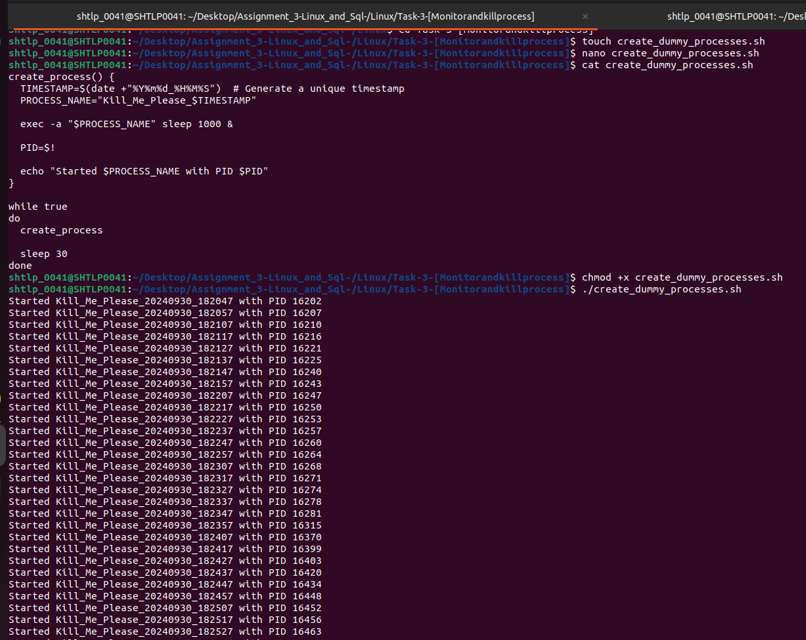

# Assignment_3-Linux_and_Sql-
## Linux 
### Task1 (File Permissions)
![!\[alt text\]](Linux/screenshots/Task-1.png)
---
## Task - 2(Process Management)
!
---

## Task - 3 [Monitor and Kill Processes]

---
## Task -4 

## SQL 
### Task -1 [filtering and sorting]
