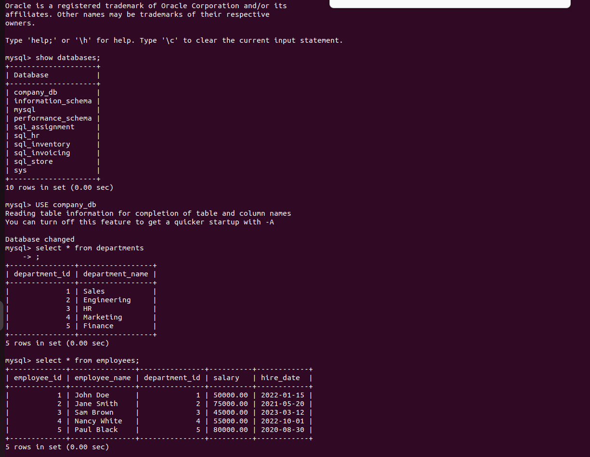

# Assignment_3-Linux_and_Sql-
## Linux 
### Task1 (File Permissions)
![!\[alt text\]](Linux/screenshots/Task-1.png)

File Permissions: Created a file named example.txt and modified its permissions so that only I, as the owner, can read and write to it, while the group and others have no access. Verified the permission changes by listing the file details.

## Task - 2(Process Management)

Process Management: Used a command to view all running processes and identified the process ID (PID) of an active process (such as my terminal). Terminated the process using its PID and confirmed it was successfully stopped.

## Task - 3 [Monitor and Kill Processes]

Monitoring and Terminating Processes: Developed a shell script called monitor_kill_processes.sh that continuously monitors for new processes. The script detects and terminates any process starting with "Kill_Me" and logs the process name, PID, and termination time into a file named killed_processes.log. Tested the script by creating dummy processes every 10 seconds to ensure it worked as expected.

## Task -4 

File Monitoring and Database Upload: Created a shell script to monitor a specific directory for newly created or modified files. The script identifies the largest file, uploads new files to a local SQL database while preventing duplicates, and logs the name, size, and timestamp of processed files, as well as any detected duplicates, in file_monitor.log. Set up a cron job to run the script every 10 seconds.

## SQL 
### Task -1 [filtering and sorting]

This project involves creating a database table called orders, inserting sample data into it, and running SQL queries to filter and sort the data.
The orders table stores details about customer orders, including order ID, customer ID, order date, and the total amount. Sample data is added for various customers and orders, allowing for meaningful queries.
1.The SQL queries demonstrate how to retrieve and analyze order data:
Filter orders where the total amount is between 100 and 500.
2.Retrieve and sort orders by total amount in ascending order.
3.Filter orders with a total amount between 100 and 500, placed within the last 30 days.
These examples showcase basic SQL operations like filtering, sorting, and working with date intervals to analyze order data effectively.

### Task -2 []

This project involves creating two tables: customers and products, with details about customers and products, respectively. Sample data for customers (names and cities) and products (names and prices) are inserted into these tables.
The SQL queries demonstrate joining the customers, orders, and products tables to perform meaningful analysis:
A query that retrieves customer names and their total order amounts by joining the customers and orders tables.
Another query calculates the total order amount for each customer by multiplying product prices with the quantity ordered. It also lists the ordered products using the GROUP_CONCAT function and groups the results by customer.
These queries allow for deeper insights into customer purchases and product ordering behavior.
### Task -3 []

Overview
This project involves two tables, employees_2023 and employees_2024, which contain employee records for each respective year. The data includes the employee's ID, name, and department. Various SQL queries are used to analyze the data across the two years, such as finding unique employees, employees common to both years, and those who only worked in 2023.

Table Structure
employees_2023
employee_id: Unique ID for each employee.
name: Employee's full name.
department: Department where the employee worked in 2023.
employees_2024
employee_id: Unique ID for each employee.
name: Employee's full name.
department: Department where the employee worked in 2024.
Data Insertion
Sample data is inserted into both employees_2023 and employees_2024, representing employees and their respective departments for each year.

Queries

1.Unique Employees Across Both Years:
This query retrieves a list of all unique employees who worked in either 2023 or 2024 using the UNION operator.

2.Employees Common to Both Years:
This query finds employees who worked in both 2023 and 2024 by using the INTERSECT operator.
Employees Who Worked Only in 2023.

3.This query retrieves the list of employees who worked in 2023 but not in 2024 using the EXCEPT operator.

### Task -4 []

This project involves querying the company_db database to explore its structure and content. The following actions are performed:

1.Show All Tables: The SHOW TABLES command is used to list all the tables available in the company_db database.

2.Retrieve Data from the departments Table: A query is executed to select and display all records from the departments table, which contains information related to different departments within the company.

3.Retrieve Data from the employees Table: A query is run to select and display all records from the employees table, providing information about the employees, such as their IDs, names, and other relevant details.

These queries allow for an exploration of the company’s database structure and the contents of the departments and employees tables.

